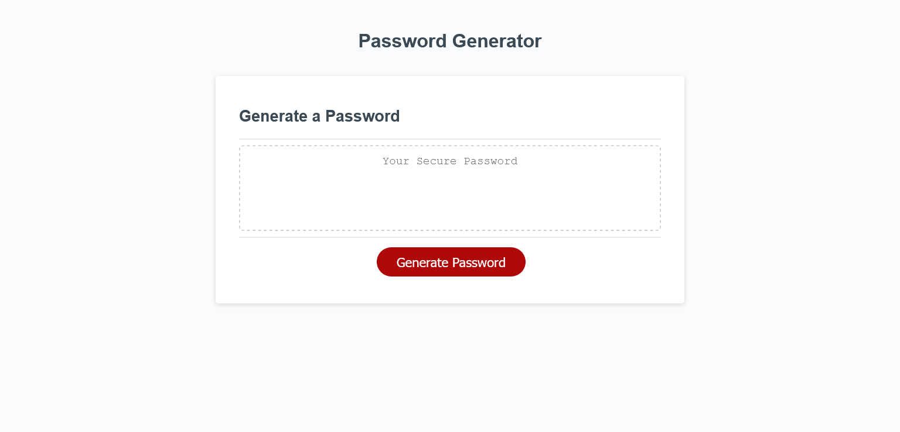

# Password Generator

## Purpose
To write Javascript code that generates a password after being prompted about desired password length and character types that you would like to be in it. 

## Website
https://sam-clark1.github.io/password-generator/

## Screenshot

## Description
- Includes a button that when clicked, brings up a prompt asking for how long you would like your password to be (must be between 8 and 128 characters.)
- Asks what king of characters you would like present in your password which include:
    - Lower case
    - Upper case
    - Numbers
    - Special characters
- When all prompts have been answered, a password is generated by a for loop and is displayed in the big box on the website. 